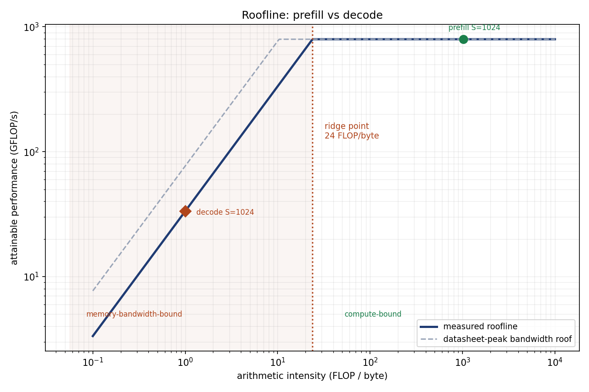

# prefill-decode-roofline

**This machine sustains well under half of its datasheet memory bandwidth, and
that is the number that governs token generation.**

This repo answers one question — *where does measured memory bandwidth fall
short of theoretical peak, and why* — on one machine, a 24-thread CPU with
DDR5 and no GPU. It measures that machine's two roofs with STREAM-style kernels
and dense GEMMs, computes the arithmetic intensity of transformer prefill and
decode analytically, and places both phases on the resulting roofline. It is
deliberately narrow: no serving engine, no model weights, no GPU. Anything that
does not help answer that question is out of scope.

```
$ python -m pytest -q
40 passed

$ python scripts/generate_results.py
measuring STREAM bandwidth (isolated process)...
measuring GEMM throughput (isolated process)...
wrote roofline.md (committed), roofline-raw.md (gitignored), roofline.png (committed)
```



## The measurement

Two roofs, both measured here rather than quoted from a datasheet:

- **Bandwidth roof** — four STREAM kernels (copy, scale, add, triad) swept
  across working-set sizes from 256 KB to 128 MB, so the cache-to-DRAM cliff is
  visible instead of averaged away. Only DRAM-resident points set the roof.
- **Compute roof** — square fp32 GEMMs, whose `2N³ / 3N²` arithmetic intensity
  puts them firmly on the compute side of the ridge.

The headline result is the gap. Sustained DRAM bandwidth lands at **well under
half the datasheet peak** (2 channels × 4800 MT/s × 8 B = 76.8 GB/s). Repeated
runs here measured between 37% and 45% — the spread depends on what else the
process has allocated — so the committed claim is the qualitative one, asserted
against a 25-60% range, with the exact per-run percentage kept in the gitignored
raw artifact.

That shortfall is normal rather than a defect — the datasheet figure assumes no
refresh, no page misses and perfect read/write turnaround — but it matters
because *decode is the phase that bandwidth governs*. Sizing a deployment
against the advertised number overestimates decode throughput by roughly this
factor.

A second measured result: bandwidth with cache-resident arrays is **at least
3×** what the same kernel sustains from DRAM (measured 3-5× across runs, so the
asserted floor is what gets reported). A single-size bandwidth benchmark reports
whichever side of that cliff it happened to land on.

## Prefill vs decode

Arithmetic intensity is computed from layer dimensions (GPT-2 124M geometry;
no weights are downloaded), counting dense matmuls and attention products.

| phase | arithmetic intensity (batch 1, S=1024) | vs ridge point | bound by |
|---|---|---|---|
| prefill | ~1024 FLOP/byte | above | **compute** |
| decode | ~1 FLOP/byte | below | **memory bandwidth** |

Decode's intensity is ~1 FLOP/byte *by construction*: it does two FLOPs per
two-byte weight, because it loads the entire model to produce a single token.
Prefill loads the same weights once and reuses them across every prompt token.
No memory system has a ridge point near 1, so decode lands on the bandwidth
roof on any hardware — the measured ridge point here is in the tens of
FLOP/byte, and an HBM-class ridge point is in the hundreds, which makes decode
*more* memory-bound, not less.

The practical consequence: the roofline caps decode at a few percent of this
machine's peak FLOP/s. That is not a kernel-quality problem, and no matmul
optimisation fixes it.

Batching is the real lever, and it has a measured ceiling: a 32× batch raises
decode intensity by only **~4.8×**, not 32×, because the KV cache scales with
the batch while the weights do not. It moves decode along the bandwidth roof
without crossing the ridge.

## Design decisions

- [ADR 0001: why tokens/sec is the wrong headline](docs/adr/0001-why-tokens-per-second-is-the-wrong-headline.md)
  — the judgement artifact. Tokens/sec averages two phases with opposite
  bottlenecks, so it describes the benchmark's prompt mix as much as the system.

Two engineering decisions worth flagging, both forced by measurements that were
initially wrong:

- **Each roof is measured in a spawned process.** Measuring both sweeps in one
  interpreter understated the compute roof by 2.7× (850 → 310 GFLOP/s), because
  CPython does not return freed arenas to the OS and the second sweep allocated
  under memory pressure. A 25 s cooldown did not recover it, which is what ruled
  out thermal throttling. See `src/prefill_decode_roofline/isolation.py`.
- **The sweep stops at 128 MB per array.** Larger working sets collapsed by ~3×,
  which measures the OS pager rather than the memory controller. 128 MB is
  already past the 30 MB L3, which is all the DRAM plateau requires.

## Results

Every number above is produced by `scripts/generate_results.py`, which carries
the date, hardware, seed, reproduce command and raw-artifact path, and
**asserts each of its own claims** — it exits non-zero if a measurement stops
supporting the prose.

- [`results/roofline.md`](results/roofline.md) — committed. Only
  machine-independent claims: efficiency bands, the cache cliff, which resource
  bounds each phase.
- `results/roofline-raw.md` — gitignored. Absolute GB/s and GFLOP/s from
  whichever machine ran it.

The split is deliberate. Byte-comparing this laptop's DDR5 plateau against a CI
runner is a gate that fails for no useful reason; committing the claims that
*are* portable makes both the gate and the claim stronger.

## Quickstart

```bash
uv sync --extra dev
uv run pytest -q
uv run python scripts/generate_results.py
```

## Limitations

- **No GPU was measured.** This machine has none. The repo establishes where
  *this* memory system falls short of *its* datasheet peak. It does **not**
  establish the ridge point of any GPU, nor what fraction of HBM peak a real
  accelerator achieves. The HBM comparison in the results is arithmetic on
  published vendor figures, not a measurement taken here.
- **Arithmetic intensity is analytic, not profiled.** Computed from layer
  dimensions, ignoring softmax, layernorm and activations. Those move bytes, so
  the true intensity is slightly *lower* than reported — which strengthens
  rather than weakens the decode conclusion.
- **No end-to-end inference was run.** No TTFT or TPOT was measured and no
  weights were downloaded, despite the ADR recommending both as headline
  metrics. The claims here are about the physics a serving engine operates
  under, not about any engine's implementation.
- **numpy is not a tuned STREAM.** There is no fused multiply-add, so `triad`
  makes two passes and reads lower than `add`. A compiled STREAM with
  non-temporal stores would report a higher peak, making the measured/
  theoretical gap reported here an upper bound on the true gap.
- **One machine, one OS, fastest-of-N timing.** Suppresses scheduler noise but
  cannot remove whatever else the OS was doing.

## Concepts covered

- 3A prefill vs decode: compute-bound vs memory-bandwidth-bound
- 3A arithmetic intensity, roofline thinking
- 3A TTFT, TPOT, goodput
- 3A MFU, HBM bandwidth
- 1A scaling laws: over-training small models for inference efficiency

## License

MIT
